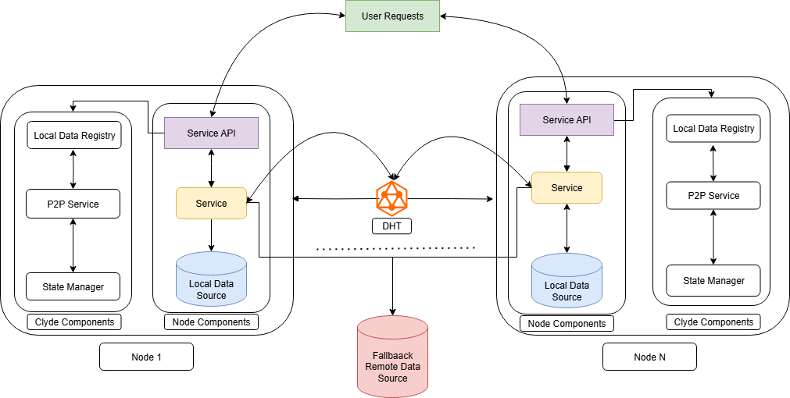

## Clyde

  
  Clyde is a high-performance peer-to-peer (P2P) data acceleration engine built for rapid, large-scale delivery across diverse and distributed compute environments. Originally designed to optimize container image distribution across cluster nodes, Clyde now extends its capabilities to general content delivery including Huggingface models and Python (pip) packages. By leveraging intelligent peer discovery and local data sharing, Clyde reduces network overhead, speeds up deployment times, and enhances scalability for AI and Cloud-native workloads.

## Features

1. **Container Image Distribution:** Clyde accelerates container image delivery across nodes through peer-to-peer sharing, reducing pull times and registry load.
2. **Hugging Face Model Distribution:** Large AI models are efficiently distributed using Clyde’s decentralized network, minimizing bandwidth and improving availability.
3. **Pip Package Distribution:** Python packages are fetched and shared locally within the cluster, enabling faster installs and reduced dependency on external repositories.
4. **Design Simplicity:** Clyde uses a simplified stateless design making it performant and easy to extend.
5. **Speed:** Data is cached locally on nodes and transmitted through the peer-to-peer network to enable faster delivery across the cluster.
6. **Saving:** Save bandwidth by serving content locally instead.
7. **Versatile:** Avoids rate-limiting and works even when external sources are down.
8. **Pre-seeding** Preseed common images to nodes before larger deployment. Please read through our  [documentation](tools/seeding/README.md) for more information.

## Motivating Results

For more details, please see our [experimental results](./docs/install.md#experiments)

| Container Images                                   | HuggingFace Models                          | pip Packages                                 |
| -------------------------------------------------- | ------------------------------------------- | -------------------------------------------- |
|  |  |  |

## Design & Architecture

For more information on the design architecture, please read through our [documentation](./docs/design.md).

## Technical Guides

### Building 

Please follow the [build](./docs/build.md) guide for details on building the project from source.

### Installation 

Please follow the [install](./docs/install.md) guide to get started.

## Contribution

We welcome new contributors! And we are happy to provide guidance and help for new contributors. Clyde follows the standard Go formatting conventions. If you find a bug or have some ideas, please submit an issue.

Please read through the [build](docs/build.md) guide for details.

### Acceptance Creteria

- Tests pass `make unit-test`
- Linter passes `make lint` 
- Solves the issue
- Adds tests then run `make lint unit-test`
- Updates documentation
- Update helm docs if any `make helm-docs`
- One logical change
- Follows project style

## Acknowledgement

Many thanks to the developers of [Spegel](https://github.com/spegel-org/spegel) especially Philip.
