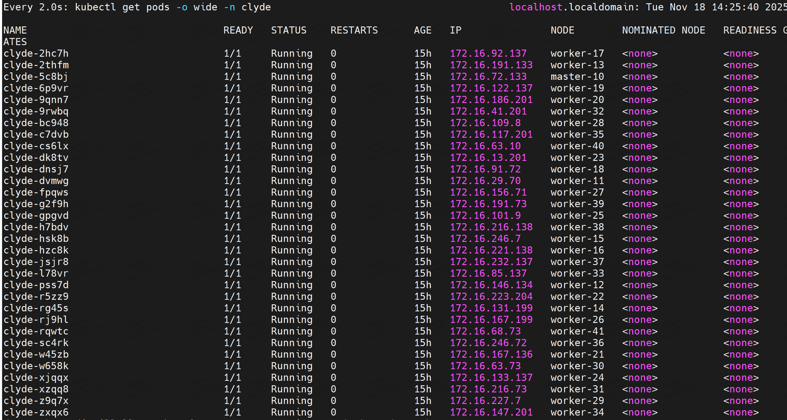
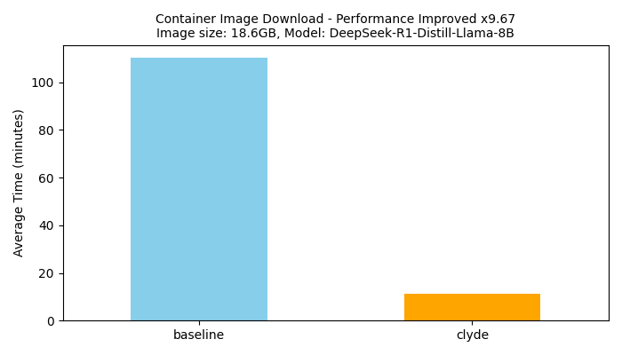
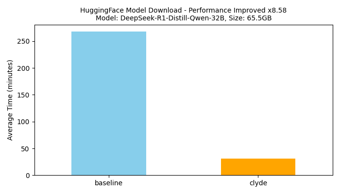
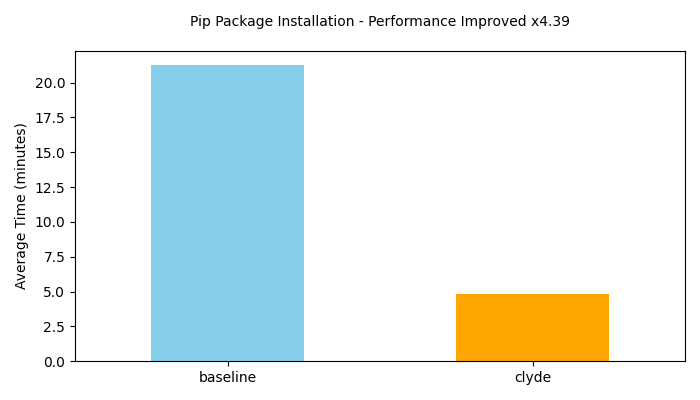

## Setting up
The below configuration must be executed on all the nodes
## Prerequisite
1. A kubernetes cluster: 1.20+
2. Containerd: 1.50+
3. Helm: 3.80+
4. pip: 25.1+
5. huggingface_cli: 0.34+

## Containerd Configuration
1. On all nodes, open /etc/containerd/config.toml
2. Set containerd to config_path and set discard_unpacked_layers = false. See sample truncated config below. Make sure your root points to a directory with lot of space. ```Best to write a script if you have many nodes.``` 

```bash
version = 2
root = "/var/lib/containerd"

[plugins]
    ...
    
    [plugins."io.containerd.grpc.v1.cri".containerd]
      discard_unpacked_layers = false
      ...
    
    [plugins."io.containerd.grpc.v1.cri".registry]
      config_path = "/etc/containerd/certs.d"
```
3. Restart containerd and check the status to make sure it is running

## Additional Configuration Auto Configuration
> You don't have to do this, it is just for information!

When you install clyde in your cluster, the installation daemonset configures both pip and huggingface and create config or data directories. The following are set:

### Pip:
1. PIP_DATA_DIR: This is where pip packages are streamed to. The directory contains `.whl, .htlm and .zip` and related files. By default this is at `/data/cache/pip/wheel/`
2. The file `/etc/pip.conf` contains configuration for our proxy. If you uninstall Clyde, you should manually remove this file to use pip normally.
 
### HuggingFace
1. HF_CACHE_DIR: The daemonset auto creates this directory and this is where model files are downloaded to. The default location is at `/data/cache/hf/model/`

## Quick Start
The quick install guide installs Clyde directly from the Clyde Helm Chart hosted on GitHub Container Registry (GHCR):

> IMPORTANT: if you have changed the ```root``` of your containerd configuration to a different path, use helm --set command or -f filename.yaml to override the settings in the chart. See [here](../charts/clyde/values.yaml) for default values.

### Installation
``` bash
1. Create namespace in your k8s cluster called clyde `kubectl create namesapace clyde`
2. Run `helm install clyde oci://ghcr.io/clyde-org/charts/clyde --version v1.1` to install clyde
3. Run `kubectl get pods -o wide -n clyde`
```

``Note: if you get an error to with /etc/resolve.conf on platforms such as aws you must override clyde pip settings in your values.yaml or use the command below.`` 

#### Pip config path
```bash
pip:
  # -- Path to the pip configuration file
  pipConfigPath: "/etc" 
```

or you can use the command to override the default `pip.pipConfigPath` value

```bash
helm install clyde oci://ghcr.io/clyde-org/charts/clyde \
  --version v1.1 \
  --set pip.pipConfigPath=/etc/pip.conf
```



### Test
Follow the steps below to test each component. For large scale testing see the `workload` directory in the project. 

#### Container Images:
1. Baseline: on one of your k8s nodes using docker, crictl or nerdctl e.g. run `time crictl pull image_name` or `time nerdctl pull image_name`
2. Clyde: on another node,  run the same command and compare the time.  

As show below, baseline took about 8 seconds while clyde took half of that time. 
```
Baseline on node14
time crictl pull ubuntu:18.04
Image is up to date for sha256:f9a80a55f492e823bf5d51f1bd5f87ea3e....

real    0m7.886s
user    0m0.022s
sys     0m0.017s
```

```
Clyde on node39
time crictl pull ubuntu:18.04
Image is up to date for sha256:f9a80a55f492e823bf5d51f1bd5f87ea3e...

real    0m3.480s
user    0m0.017s
sys     0m0.016s
```
Follow the same procedure for huggingface and pip. You can use `hf download model_name` and `pip install package` respectively.

### Uninstall
helm `delete clyde -n default --no-hooks`

## Build and Install from Source

To build from source follow the instructions [Here](build.md)


## Experiments
The experiments evaluate Clyde to demonstrate the performance benefits over baselines. For each of these experiments we measure the end-to-end time to run the experiment on all the nodes and take the average of execution time accross all the nodes. 

### Setup
1. Hardware: The experiments are executed on a 32 (28) node kubernetes cluster, each node has 64GB memory and 16vCPUs. Each pyhsical machine in the cluster host 4 of the 32 virtual mahcines. 
1. Repo: The entire experiment is containerised and all the workloads are stored on [ghcr.io/clyde-org/](ghcr.io/clyde-org/packages)
2. Seed & Baseline: The baseline pulls the image or artifacts from remote repositories such as ghcr.io, huggingface.com and pypi.org and once completed two nodes are used as seeds for the rest of the nodes to pull from using Clyde.

### Workloads
**Comtainer Image Distribution:** The size of the image used in this experiment is 18.6GB AI images, the model included the image is DeepSeek-R1-Distill-Llama-8B. This is inline with the requirement we got from China mobile.  

**HuggingFace Model Distribution:** For huggingface model download, the model used is DeepSeek-R1-Distill-Qwen-32B the size of which on disk is 65.5GB. 

**Pip Package Distribution:** For pip package installation, the following packages were included. These are large AI packages
```python
PACKAGES = [
    "torch",
    "tensorflow",
    "torchvision",
    "torchaudio",
    "jax[cpu]",
    "transformers", 
    "mxnet",
    "opencv-python",
    "xgboost",
    "lightgbm",
    "pyspark",
]
```

### Results
These results are based on our cluster setup and the performance depends on the bandwidth to the baseline repo and the bandwidth between the nodes. However the performance improvement should be consistent if a different environment is used. 

#### Container Image Download
For the 18.6GB image, Clyde cuts download time from ~110 min to ~12 min, ~9× faster.




#### HuggingFace Model Download
For the 65.5GB model, Clyde reduces download time from ~270 min to ~37 min, ~7× faster.



#### Pip Package Installation
Clyde reduces installation time from ~21 min to ~5 min, a ~4× speedup for large AI packages.




## Clyde Nydus Integration

Nydus and Clyde seemlessly integrate without much configuration. The way it works is Clyde sits in the middle as a transparent cache. The basic flow is described below.

* Nydus asks containerd to pull an image
* Containerd checks its registry configuration (hosts.toml) given below: nodeip:port
* ALL pull requests are redirected to 192.168.201.14:30021 (your Clyde registry)
* Clyde serves the content from its cache or fetches from upstream

### Containerd Config on each node

```
[host.'http://192.168.201.14:30020']
[host.'http://192.168.201.14:30021']
capabilities = ['pull', 'resolve']
```

