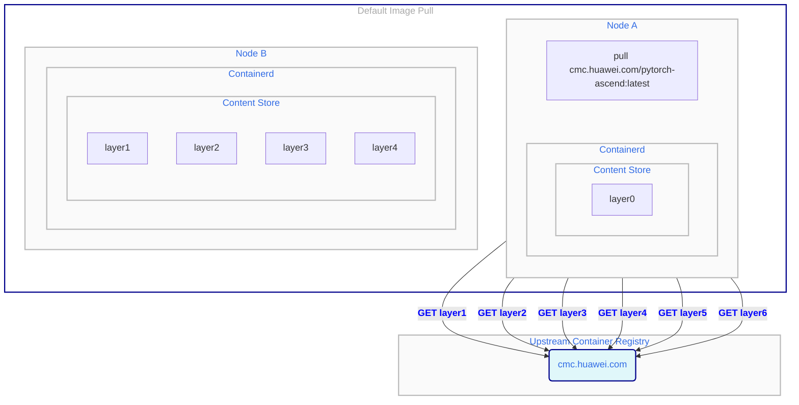

```mermaid
graph TD;
subgraph Cluster[Default Image Pull]
    subgraph ctr-1[Containerd]
        subgraph store-1["Content Store"]
            sl-2[layer0]
        end
    end

    subgraph ctr-2[Containerd]
        subgraph store-2["Content Store"]
            sl-6[layer1]
            sl-3[layer2]
            sl-4[layer3]
            sl-5[layer4]
        end
    end


    subgraph Node1[Node A]
        direction TB
        kubelet["pull cmc.huawei.com/pytorch-ascend:latest"]
        ctr-1

        kubelet ~~~ ctr-1
    end

    subgraph Node2[Node B]
        ctr-2
    end
end

subgraph Upstream[Upstream Container Registry]
    acr(cmc.huawei.com)
end

Node1 --> |<b style="color:blue">GET layer1</b>| acr
Node1 --> |<b style="color:blue">GET layer2</b>| acr
Node1 --> |<b style="color:blue">GET layer3</b>| acr
Node1 --> |<b style="color:blue">GET layer4</b>| acr
Node1 --> |<b style="color:blue">GET layer5</b>| acr
Node1 --> |<b style="color:blue">GET layer6</b>| acr    

classDef cluster fill:#fafafa,stroke:#bbb,stroke-width:2px,color:#326ce5;
class Node1,NodeN cluster

classDef registry fill:#e0f7fa,stroke:#00008b,stroke-width:2px,color:#326ce5;
class acr registry

classDef outer fill:white,stroke:#00008b,stroke-width:2px,color:#a9a9a9;
class Cluster outer
```