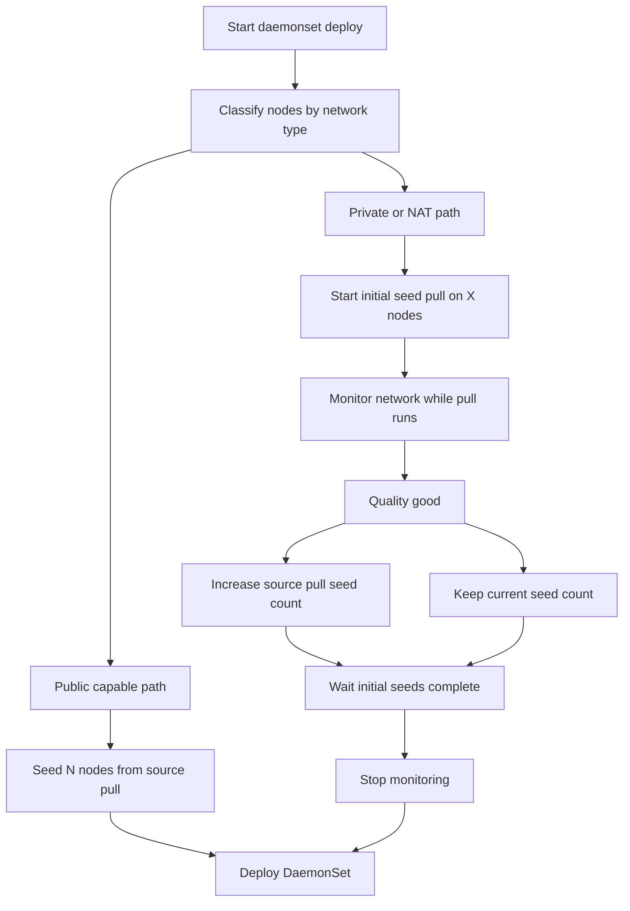

# clydectl

`clydectl` is Clyde’s intelligent Kubernetes deployment CLI. It ensures efficient image distribution for large DaemonSets by using smart seeding strategies.

## Features

- **Network-Aware Seeding**: Chooses strategy based on whether nodes expose public IPs.
- **Adaptive Private-Cluster Expansion**: Starts with initial seeds, monitors network quality, and expands source-pull seeds when healthy.
- **Kubernetes-native**: Runs directly against your cluster using standard kubeconfig.

## Usage

### Smart Deployment

The `daemonset` command first classifies node network type:

1. **Public-capable cluster** (all nodes have public `ExternalIP`):
   - Optionally pre-seed `--public-seeds` nodes from source.
   - Deploy DaemonSet directly.
2. **Private/NAT cluster** (mixed or private-only):
   - Start an initial pull on `--initial-seeds` nodes.
   - Launch monitor probe pods on different nodes from active initial seeds when available (fallback to seed nodes only when cluster is too small).
   - While those first pulls are in progress, collect timed transfer samples every `--monitor-interval` seconds over a registry blob probe:
     - average transfer bandwidth (MB/s)
     - estimated jitter (ms)
     - drop rate (% failed probe samples)
   - Decision runs at `--monitor-window` and may retry up to 3 additional windows if needed as conditions change.
   - If quality is healthy in a decision window, increase source-pull seed count in doubling waves.
   - If quality is not healthy in a decision window, stop monitoring and continue classic doubling seeding.
   - Stop seeding when at least half of cluster nodes are seeded, then deploy DaemonSet.
   - Stop monitoring once the first seed batch completes, then deploy DaemonSet.

#### Plan design



#### Example with numbers (Private/NAT path)

Thresholds:
- `--monitor-bandwidth-threshold=50`
- `--monitor-jitter-threshold=20`
- `--monitor-drop-threshold=1`

Sample while initial seeds pull:
- bandwidth `63 MB/s`
- jitter `12 ms`
- drop rate `0.4%`

Decision:
- `63 >= 50` true
- `12 <= 20` true
- `0.4 <= 1` true
- Result: **network healthy, add another seed wave from source**

```bash
clydectl daemonset \
  --name <daemonset-name> \
  --image <image-ref> \
  --namespace <namespace> \
  [flags]
```

### Flags

| Flag | Description | Default |
|------|-------------|---------|
| `--image` | The container image to deploy (required) | - |
| `--name` | Name of the DaemonSet (required) | - |
| `--namespace` | Target namespace | `default` |
| `--public-seeds` | For public-capable clusters, pre-seed this many nodes before direct deploy. | `0` |
| `--initial-seeds` | For private/NAT clusters, initial seed count before monitoring-based expansion. | `0` (10% of cluster) |
| `--disable-bandwidth-aware` | Disable monitoring and use classic doubling seeding only. | `false` |
| `--monitor-interval` | Poll/monitor interval in seconds while initial seeds are running. | `2` |
| `--monitor-window` | Minimum monitor window in seconds before first expansion decision. | `20` |
| `--monitor-image` | Optional image used to resolve the monitor blob probe source (defaults to `--image`). | - |
| `--monitor-bandwidth-threshold` | Minimum bandwidth (MB/s) to allow expansion. | `50.0` |
| `--monitor-jitter-threshold` | Maximum jitter (ms) to allow expansion. | `20.0` |
| `--monitor-drop-threshold` | Maximum drop rate (%) to allow expansion. | `1.0` |

### Examples

**Current deployment example (timed run):**
```bash
time ./clydectl daemonset \
  --image ghcr.io/clyde-org/deepseek.r1.distill.llama.8b-arm:v1.0 \
  --name clyde-app-pull \
  --namespace default
```
This command uses automatic network-type detection and default monitoring thresholds unless you pass explicit seeding/monitor flags.

**Public-capable cluster (optional pre-seed, then direct deploy):**
```bash
clydectl daemonset \
  --name inference \
  --image my-registry/inference:latest \
  --public-seeds 3
```

**Private/NAT cluster (monitor and adaptively expand seeds):**
```bash
clydectl daemonset \
  --name inference \
  --image my-registry/inference:latest \
  --initial-seeds 5 \
  --monitor-window 20 \
  --monitor-bandwidth-threshold 55 \
  --monitor-jitter-threshold 15 \
  --monitor-drop-threshold 0.8
```

**Classic doubling only (no monitoring):**
```bash
clydectl daemonset \
  --name inference \
  --image my-registry/inference:latest \
  --initial-seeds 5 \
  --disable-bandwidth-aware
```
