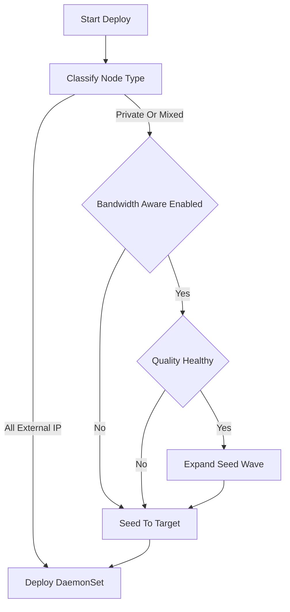

# clydectl

`clydectl` is Clyde’s intelligent Kubernetes deployment CLI. It ensures efficient image distribution for large DaemonSets by using smart seeding strategies.

## Features

- **Network-Aware Seeding**: Chooses strategy based on whether nodes expose public IPs.
- **Adaptive Private-Cluster Expansion**: Starts with initial seeds, monitors network quality, and expands source-pull seeds when healthy.
- **Flexible Seed Source**: Seed from either a container image or a Hugging Face model cache.
- **Kubernetes-native**: Runs directly against your cluster using standard kubeconfig.

## Usage

### Build clydectl

From the `tools/clydectl` directory, run tests and build:

```bash
go test ./... && go build -o clydectl .
```

This produces a local `./clydectl` binary that you can use for the commands in this README.

### Quick start

#### 1) Seed from Hugging Face model cache (disable bandwidth-aware path)
```bash
./clydectl daemonset \
  --image ghcr.io/clyde-org/hf.exp:v1.11 \
  --seed-source hf-model \
  --hf-model deepseek-ai/DeepSeek-R1-Distill-Qwen-32B \
  --hf-cache-dir /data/cache/hf/model \
  --daemonset-file ../../workloads/hf/hf_daemonset.yaml \
  --seed-stop-ratio 0.2 \
  --disable-bandwidth-aware
```

#### 2) Seed from image pull (timed run, disable bandwidth-aware path)
```bash
time ./clydectl daemonset \
  --image sneceesay77/deepseek.r1.distill.llama.8b-arm:v1.0 \
  --name clyde-app-pull \
  --namespace default \
  --seed-stop-ratio 0.2 \
  --disable-bandwidth-aware \
  --initial-seeds 1
```

### Smart deployment flow

`clydectl daemonset` first classifies cluster node type by network reachability:

1. **Public-capable cluster** (all nodes have public `ExternalIP`):
   - Optionally pre-seed `--public-seeds` nodes from source.
   - Deploy DaemonSet directly.
2. **Private/NAT cluster** (mixed or private-only):
   - Start an initial pull on `--initial-seeds` nodes.
   - If `--initial-seeds=0` (default), clydectl auto-selects initial seeds as:
     - `max(2, floor(10% of total cluster nodes))`
     - then capped to the seed target derived from `--seed-stop-ratio`
   - Effective initial seeds are always bounded by the final seeding target.
   - If `--disable-bandwidth-aware=true`, skip monitoring entirely and run classic doubling only.
   - Launch monitor probe pods on different nodes from active initial seeds when available (fallback to seed nodes only when cluster is too small).
   - While those first pulls are in progress, collect timed transfer samples every `--monitor-interval` seconds over a registry blob probe:
     - average transfer bandwidth (MB/s)
     - estimated jitter (ms)
     - drop rate (% failed probe samples)
   - Decision runs at `--monitor-window` and may retry up to 3 additional windows if needed as conditions change.
   - If quality is healthy in a decision window, increase source-pull seed count in doubling waves.
   - If quality is not healthy in a decision window, stop monitoring and continue classic doubling seeding.
   - Stop monitoring when quality is unhealthy, or when seeding target is reached.
   - Continue classic doubling seeding until the `--seed-stop-ratio` target is reached, then deploy DaemonSet.

#### Initial seed behavior

- `--initial-seeds` controls only the first seed wave on private/NAT clusters.
- `--initial-seeds=0` enables automatic sizing (10% of nodes, minimum 2, capped by seed target).
- If you set `--initial-seeds` manually, use a small value (for example `2` to `5`) and let doubling expand from there.
- `--seed-stop-ratio` controls where seeding stops (`1.0` = 100%, `0.5` = 50%, etc).

Example (10-node cluster):
- `--seed-stop-ratio=0.5` -> seed target = `5` nodes
- `--initial-seeds=0` -> auto initial = `max(2, floor(10% of 10)=1)` = `2`
- Seeding starts at 2 and then doubles/expands until 5 seeded nodes are reached

#### Plan diagram (node-type classification + execution path)


```mermaid
flowchart TD
  startNode[Start Deploy] --> classifyNode[Classify Node Type]
  classifyNode -->|All External IP| deployNode[Deploy DaemonSet]
  classifyNode -->|Private Or Mixed| monitorToggle{Bandwidth Aware Enabled}
  monitorToggle -->|No| seedToTarget[Seed To Target]
  monitorToggle -->|Yes| qualityGate{Quality Healthy}
  qualityGate -->|Yes| expandSeeds[Expand Seed Wave]
  qualityGate -->|No| seedToTarget
  expandSeeds --> seedToTarget
  seedToTarget --> deployNode
```

#### Example with numbers (Private/NAT path)

Thresholds:
- `--monitor-bandwidth-threshold=50`
- `--monitor-jitter-threshold=20`
- `--monitor-drop-threshold=1`

Sample while initial seeds pull:
- bandwidth `63 MB/s`
- jitter `12 ms`
- drop rate `0.4%`

Decision:
- `63 >= 50` true
- `12 <= 20` true
- `0.4 <= 1` true
- Result: **network healthy, add another seed wave from source**

```bash
clydectl daemonset \
  --name <daemonset-name> \
  --image <image-ref> \
  --namespace <namespace> \
  [flags]
```

### Flags

| Flag | Description | Default |
|------|-------------|---------|
| `--image` | The container image to deploy (required) | - |
| `--seed-source` | Seeding source type: `image` or `hf-model` | `image` |
| `--hf-model` | Hugging Face model repo ID used when `--seed-source hf-model` | - |
| `--hf-cache-dir` | Host path where model cache is seeded when `--seed-source hf-model` | `/data/cache/hf/model` |
| `--use-local-proxy` | Sets `USE_LOCAL_PROXY` env on the deployed DaemonSet template (for `hf-model` deployment shape). | `true` |
| `--daemonset-file` | Path to a DaemonSet YAML manifest to deploy instead of generated DaemonSet spec. | - |
| `--name` | Name of the DaemonSet (required unless `--daemonset-file` is provided) | - |
| `--namespace` | Target namespace | `default` |
| `--public-seeds` | For public-capable clusters, pre-seed this many nodes before direct deploy. | `0` |
| `--initial-seeds` | Private/NAT initial seed wave size. `0` means auto: `max(2, floor(10% of nodes))`, capped by `--seed-stop-ratio` target. | `0` |
| `--seed-stop-ratio` | Stop seeding after this fraction of nodes are seeded (`0 < ratio <= 1`). | `1.0` |
| `--disable-bandwidth-aware` | Disable monitoring and use classic doubling seeding only. | `false` |
| `--monitor-interval` | Poll/monitor interval in seconds while initial seeds are running. | `2` |
| `--monitor-window` | Minimum monitor window in seconds before first expansion decision. | `20` |
| `--monitor-image` | Optional image used to resolve the monitor blob probe source (defaults to `--image`). | - |
| `--monitor-bandwidth-threshold` | Minimum bandwidth (MB/s) to allow expansion. | `50.0` |
| `--monitor-jitter-threshold` | Maximum jitter (ms) to allow expansion. | `20.0` |
| `--monitor-drop-threshold` | Maximum drop rate (%) to allow expansion. | `1.0` |

### Examples

**Timed deployment (image source):**
```bash
time ./clydectl daemonset \
  --image sneceesay77/deepseek.r1.distill.llama.8b-arm:v1.0 \
  --name clyde-app-pull \
  --namespace default \
  --seed-stop-ratio 0.2 \
  --disable-bandwidth-aware \
  --initial-seeds 1
```
This command uses automatic network-type detection and default monitoring thresholds unless you pass explicit seeding/monitor flags.

**Public-capable cluster (optional pre-seed, then direct deploy):**
```bash
clydectl daemonset \
  --name inference \
  --image my-registry/inference:latest \
  --public-seeds 3
```

**Seed from Hugging Face model cache (use custom DaemonSet file):**
```bash
./clydectl daemonset \
  --image ghcr.io/clyde-org/hf.exp:v1.11 \
  --seed-source hf-model \
  --hf-model deepseek-ai/DeepSeek-R1-Distill-Qwen-32B \
  --hf-cache-dir /data/cache/hf/model \
  --daemonset-file ../../workloads/hf/hf_daemonset.yaml \
  --seed-stop-ratio 0.2 \
  --disable-bandwidth-aware
```

**Private/NAT cluster (monitor and adaptively expand seeds):**
```bash
clydectl daemonset \
  --name inference \
  --image my-registry/inference:latest \
  --initial-seeds 5 \
  --seed-stop-ratio 0.5 \
  --monitor-window 20 \
  --monitor-bandwidth-threshold 55 \
  --monitor-jitter-threshold 15 \
  --monitor-drop-threshold 0.8
```

**Classic doubling only (no monitoring):**
```bash
clydectl daemonset \
  --name inference \
  --image my-registry/inference:latest \
  --initial-seeds 2 \
  --disable-bandwidth-aware
```

**Classic doubling walkthrough (100 nodes, `--seed-stop-ratio 0.5`):**
- Cluster size = `100`
- Seed stop target = `ceil(100 * 0.5) = 50` nodes
- Initial seeds = `2` (explicitly set with `--initial-seeds 2`)
- Wave progression:
  - wave 1: `2` (seeded total `2`)
  - wave 2: `4` (seeded total `6`)
  - wave 3: `8` (seeded total `14`)
  - wave 4: `16` (seeded total `30`)
  - wave 5: `20` (seeded total `50`, capped by target)
- Seeding stops at `50` and then DaemonSet deployment starts.

```bash
clydectl daemonset \
  --name inference \
  --image my-registry/inference:latest \
  --seed-stop-ratio 0.5 \
  --initial-seeds 2 \
  --disable-bandwidth-aware
```
