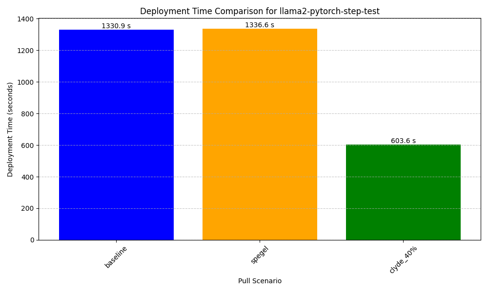
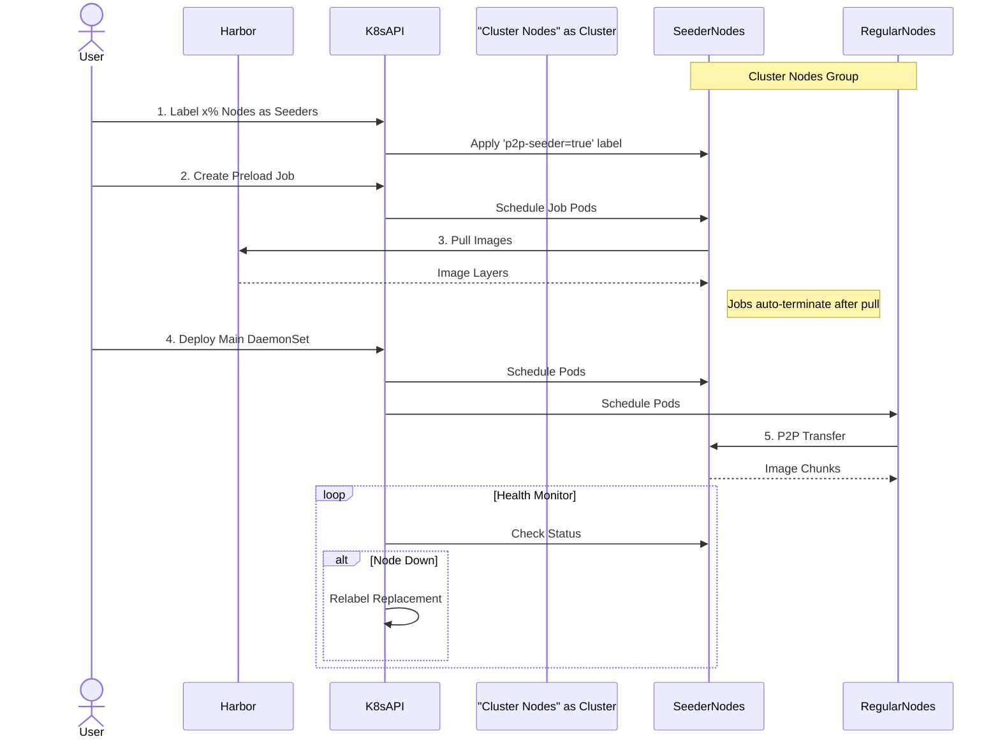

## Explanation

The ClydeSeeder utility is use to seed nodes for faster manages node labeling and image pre-pulling across a cluster. The tool works in two main phases:

**First, it labels a percentage of cluster nodes as "seeders"** - it calculates how many nodes should be seeders based on the configured percentage (default 40%), validates existing seeders, labels new ones if needed, and persistently tracks them in a JSON file. This ensures that even if the tool restarts, it maintains consistency in which nodes are designated as seeders.

**Second, it pre-pulls container images to all seeder nodes** - it reads a list of images from a file, then creates temporary DaemonSets that deploy a pod to each seeder node. These pods pull the specified images and remain running until all images are successfully pulled across the cluster. The DaemonSets are then cleaned up, leaving the images cached on the seeders for faster subsequent deployments.


## Results and Sequence Diagram 
The seeding can improve the performance by up to 50%. The sequence diagram shows how seeding works. 

<table>
<tr>
<td width="50%">
<br>

</td>
<td width="50%">



</td>
</tr>
</table>

**Required setup:**
1. Ensure you have a valid `kubeconfig` for Kubernetes cluster access
2. Create or edit an `images.txt` file in your working directory (or specified path) containing the images to pre-pull:
```
nginx:latest
redis:alpine
postgres:13
my-app:1.0.0
```
3. Install required Python packages: `kubernetes-client` and `filelock`

**Key configuration files:**
- `images.txt` - list of container images to pre-pull
- `seeder_tracker.json` - auto-generated tracker of current seeders
- `seeder.log` - execution logs

## Quick Start

```bash
# Basic usage with default settings
python seeder.py
```

## End to end

```bash
#!/bin/bash
IMAGE=$1
START_TIME=$(date +%s)
python clyde_seeder.py --images-to-seed <(echo "$IMAGE") --seeder-percentage 20
kubectl apply -f workload.yml
END_TIME=$(date +%s)
echo "End-to-end time: $((END_TIME - START_TIME)) seconds"
```

## More options

```bash
# Minimal custom setup
python seeder.py --seeder-percentage 30
```

```bash
# Custom configuration example
python seeder.py \
    --base-dir /path/to/your/config \
    --seeder-percentage 50 \
    --namespace my-namespace \
    --log-level INFO \
    --no-stdout
```

```bash
# With custom file paths (relative to base-dir)
python seeder.py \
    --base-dir /opt/clyde \
    --seeder-tracker-file data/seeders.json \
    --images-to-seed config/images.txt \
    --log-file logs/seeder.log
```


