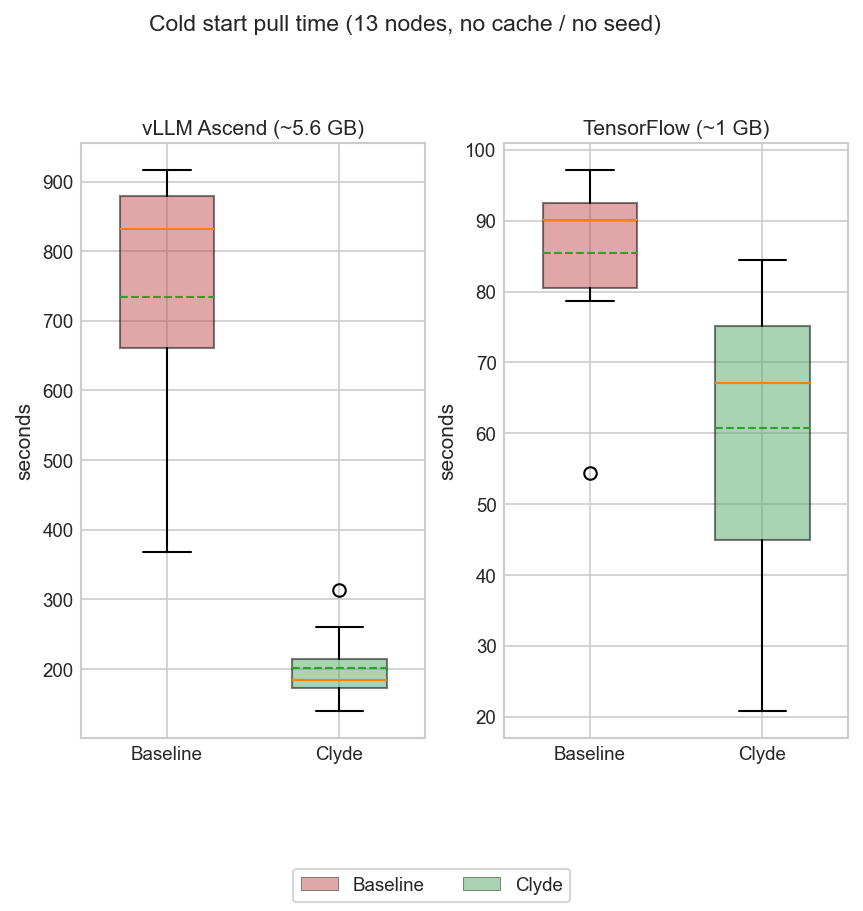

# Cold start: Baseline vs Clyde (13 nodes)

- **Setup:** DaemonSet, one pod per node, **no cache / no seed**.
- **Plots:** One row — **vLLM ~5.6 GB** | **TensorFlow ~1 GB**; each panel is **Baseline then Clyde** (Clyde is faster). Single legend.
- **TensorFlow:** Capture had two cold pulls; **slower pull = Baseline, faster = Clyde** (labeling only).
- **vLLM:** Slower path = Baseline, **Clyde = content-create path** (~73% lower mean vs Baseline in the capture).
- **Code:** `pkg/oci/containerd.go` — subscribe **275**, `ContentCreate` **356**, `ImageCreate` **382**.

```275:276:pkg/oci/containerd.go
	eventFilters := []string{`topic~="/images/create|/images/delete",event.name~="^.+/"`, `topic~="/content/create"`}
	envelopeCh, cErrCh := c.client.EventService().Subscribe(subCtx, eventFilters...)
```



Regenerate: `mkdir -p .mplconfig && MPLCONFIGDIR="$PWD/.mplconfig" ./.venv/bin/python generate_cold_start_report.py`
